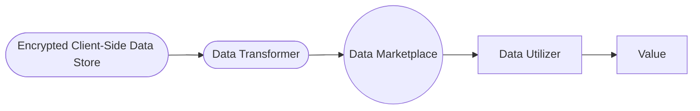
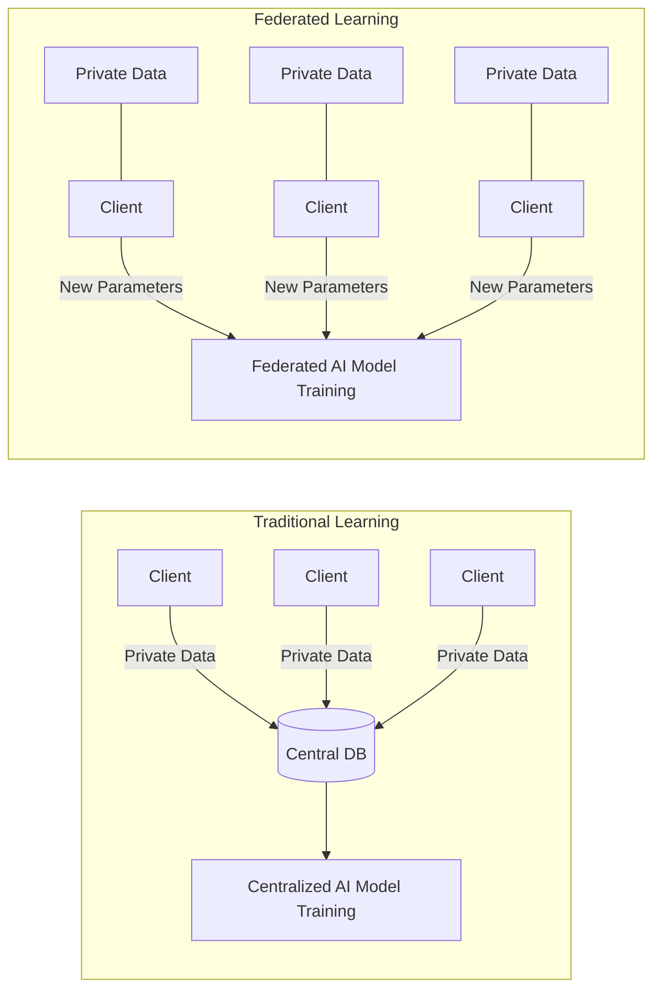
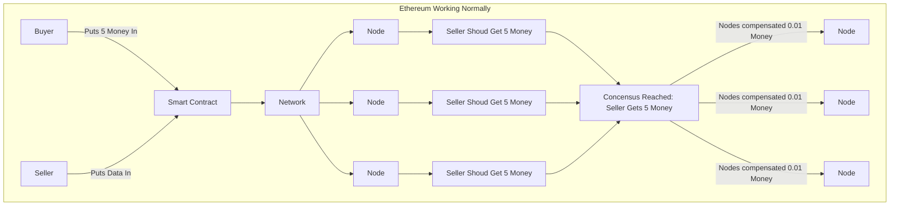
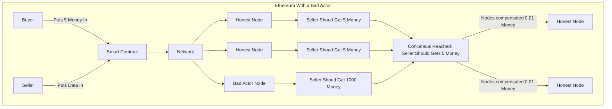
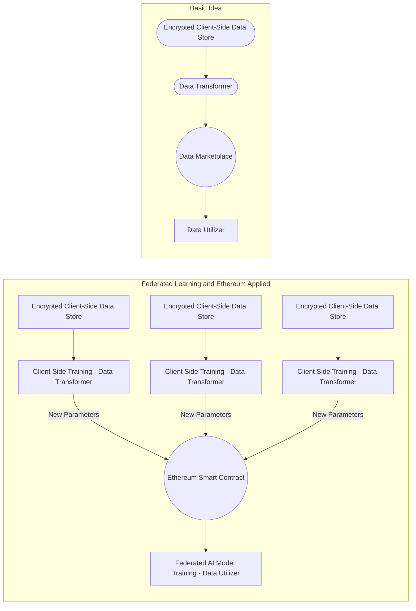
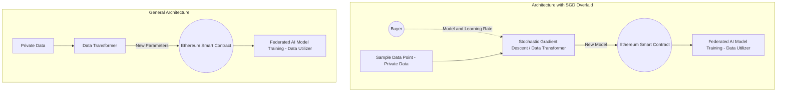

# The Data Wallet

People are learing their private data is valuable.

For a long time there has been a hidden contract between people using free internet services and the companies building those services. People can use the service for free in exchange for the rights to their private data. This includes things like your social media posts, your browser history, even down to how much time you spend looking at something.

Some of the most profitable companies in the world are able to drive those profits by using your private data. Without the use of that data, those companies would be less profitable. One popular narrative is that these companies are "selling your data to advertisers". Therefore your data should have some monetary value. This begs a few questions:

* Precisely how valuable is my private data?
* Am I getting an objectively fair deal when I exchange my private data for the ability to use an internet service?
* How can I prevent my data from being taken from me unfairly?

With commodities like oil these questions are fairly easy to answer because there is a transparent and competitive market for oil. We can't treat data exactly like oil because it can be copied and shared, but we can consider the utility of the data. This leads us to our motivating question: **What would it look like for you to own your data and have the ability to sell its utility on an open market?**

## The Basic Idea

We would like to have a system where you can be paid money in exchange for using your private data without actually sharing the private data. This system will need a few basic components.

* **Encrypted Client-Side Data Store:** This is where your private data is kept. Nobody can access this data other than you ever. Raw unencrypted data from this store can never leave your device. This data can be anything from private messages to browser history to health telemetry and beyond.
* **Privacy Preserving Data Transformer:** This component is required to transform your data so that it still has utility, but makes it impossible to determine the underlying dataset.
* **Data Marketplace:** This component should allow buyers to request certain kinds of data utility and allow sellers to fulfill that request in exchange for money.
* **Data Utilizer:** This is the component that receives data from the marketplace and in turn provides some value. 



The encrypted data store is pretty straight forward, but it's not so clear what properties the other three components should have besides what has already been stated. Some new technologies have emerged in the past 5 years that can give us some help here.

## Background Technologies

In order to build this market we need a few special technologies which have emerged in the past 5 years.

**Federated Learning**

One of the reasons data is valuable is that it's used to train AI models. Usually if you want to train an AI model you have to have all of the raw training data on a centralized database. Federated learning is different. Instead of pulling possibly private data into a vulnerable central database, it does training on client devices like people's smartphones and sends model updates to the central server. No private data shared.



**Ethereum**

Ethereum allows us to build a transparent market to exchange money for data. The big advantage here is no single entity controls the exchange so there can be no favorites. The way it works is we define a "smart contract". When a smart contract is activated, it will execute the terms of the contract automatically. 

The terms are executed by thousands of computers simultaneously. The computers receive some monetary compensation for correctly executing the contract. An attacker that tries to execute the terms of the contract unfairly would need to control more than half of the computers in the network to do so (the popular "51% attack"). This would be staggeringly expensive.



Here is an example of Ethereum working normally. **1st** buyer puts 5 money into a smart contract and a seller puts in the data that is to be sold. This data can be encrypted or obfuscated in a way that makes the data valuable to the buyer even though it is being shared on a public channel. **2nd** the terms of the smart contract are computed by thousands of nodes on the network. Every node should get the same result "Seller should get 5 money". **3rd** concensus is reached and the seller receives 5 money. **4th** the nodes receive small compensation for computing the contract.



Here is an example of Ethereum working with the presence of a bad actor. It's exactly the same situation as before except the bad actor tries to award the seller more money than what the rest of the network agrees on. The correct consensus is still reached and the bad actor **is not** compensated.

## Architecture

Now let's take these technologies and apply them to our basic idea. This application of technologies to this problem is what I call "The Data Wallet".

* **Encrypted Client-Side Data Store:** As stated before this is straightforward. No special tool needed here.
* **Privacy Preserving Data Transformer:** Applying <u>Federated Learning</u> technology we can transform the private data into something useful while maintaining privacy. Federated Learning techniques allow us to build the data transformer component.
* **Data Marketplace:** Applying an <u>Ethereum Smart Contract</u> gives us the data marketplace that we need to efficiently exchange money for data utility. Ethereum's decentralized property means the market will never play favorites. Ethereum's transparent property allows price competition.
* **Data Utilizer:** Applying <u>Federated Learning</u> technology we can use the transformed data to train artificial intelligence which can in turn be used to produce value.



## Marketplace Implementation

Everything centers on the smart contract so let's start there. Here is how the contract should work.

1. The buyer requests data from a specific seller. The request has information regarding how to fill the request and comes **pre-paid**.
2. The seller can only have one active data request directed at them at a time.
3. The seller fulfills the request by posting the new data to the network (can be encrypted or obfuscated).
4. The seller receives funds.

*If the seller doesn't want to fulfill the request*:

1. The seller denies the request.
2. The request is no longer active.
3. The buyer receives their payment back.

*If another buyer wants to make a request to a seller with an active request:*

1. The second buyer offers a request at a higher price and the rest of the steps above apply.
2. The original request is no longer active.
3. The first buyer receives their payment back.

### The Escrow Contract

In order for prepayment to work and ensure funds are always available for the transaction we need an escrow contract. I've used the Solidity language to implement the contracts. The contract is created with a **buyer** and a **seller** and has 3 operations

* deposit() - The buyer puts money into the contract. The contract now holds the money and the contract is AWAITING_DELIVERY.
* confirmDelivery()  - Delivery is confirmed and funds are transferred from the contract to the seller. The contract is now COMPLETE.
* refundBuyer() - Someone decides to back out of the contract and the buyer receives funds back. The contract is now COMPLETE.

```c#
contract TDWEscrow {
    enum State { AWAITING_PAYMENT, AWAITING_DELIVERY, COMPLETE }
    
    State public currState;
    
    address payable public buyer;
    address payable public seller;
    
    constructor(address payable _buyer, address payable _seller) public {
        buyer = _buyer;
        seller = _seller;
    }
    
    function deposit() external payable {
        require(currState == State.AWAITING_PAYMENT, "Already paid");
        currState = State.AWAITING_DELIVERY;
    }
    
    function confirmDelivery() external {
        require(currState == State.AWAITING_DELIVERY, "Cannot confirm delivery");
        seller.transfer(address(this).balance);
        currState = State.COMPLETE;
    }

    function refundBuyer() external {
        require(currState == State.AWAITING_DELIVERY, "Cannot refund buyer");
        buyer.transfer(address(this).balance);
        currState = State.COMPLETE;
    }
}
```

### The Main Contract

Now that we have the escrow contract we can build our main contract that form the backbone of our marketplace. First we'll look at the structure of the request.

**DeltaRequest** 

A buyer is requesting an update for their model (aka a delta). This request has quite a bit of data attached to it for various purposes.

* from - Who created the request.
* to - Who the request is directed at.
* amount - How much money will be paid for fulfilling the request.
* requestID - A unique ID associated with this request.
* modelJSON - The data necessary for the seller to properly compute the Delta to fulfill the request.
* metaData - Metadata about the request that can be used to compare different requests on the market. For instance a model that uses more features for training might be fetch a higher price on the market. This info can facilitate competition on the market.
* escrow - An instance of the Escrow contract that is created when the delta request is created. 

```c++
    struct DeltaRequest {
        address from;
        address to;
        uint256 amount;
        uint256 requestID;
        string modelJson;
        TrainingMetaData metaData;
        TDWEscrow escrow;
    }

    struct TrainingMetaData {
        uint32 numberOfFeatures;
        TrainingType trainingType;
    }

    enum TrainingType {
        EMPTY,
        STOCHASTIC_GRADIENT_DESCENT,
        GRADIENT_BOOSTING_DECISION_TREE
    }
```

**Events**

In addition to the DeltaRequest we also broadcast events to the marketplace.

* Delta - When a seller fulfills a request a "Delta" is broadcast to the marketplace indicating the price that was paid and some meta data for what kind of data was exchanged. This effectively creates a price quote. There is also a flag that indicates whether the buyer correctly indicated the metadata in the initial request.
* RequestWasOutbid - Emitted when another buyer requests data from a seller at a higher price.
* RequestWasDenied - Emitted when the seller denies the request. The seller can indicate the price they want to be paid.

```
		event RequestWasOutbid(
        uint256 _requestID,
        uint256 _oldAmount,
        uint256 _newAmount
    );
    event RequestWasDenied(
        uint256 _requestID,
        uint256 _oldAmount,
        uint256 _desiredAmount
    );
    event Delta(
        address indexed _from,
        address indexed _to,
        string _deltaJson,
        uint256 _amountPaid,
        TrainingMetaData _metaData,
        bool _didTrainingMetaDataMatch
    );
```

Now we have the basic building blocks for our smart contract. Let's put them together with some methods for interacting with the smart contract.

**getActiveRequest**

Simple method that returns the caller's active request. Only one can be active at a time.

```c++
	function getActiveRequest()
        public
        view
        returns (
            address,
            string memory,
            uint256
        )
    {
        DeltaRequest memory activeRequest = activeRequests[msg.sender];
        return (
            activeRequest.from,
            activeRequest.modelJson,
            activeRequest.requestID
        );
    }
```

**requestDelta()**

This method has 4 steps:

1. **Verfication** -  If the receiver has a higher value active request, the new request is automatically rejected.
2. **Refund outstanding requests** - If an outstanding request exists, refund the original buyer. A <u>RequestwasOutbid</u> even is published.
3. **Create request** - Creates the escrow contract and the DeltaRequest. All the necessary info to create the request was passed in as arguments to the method.
4. **Fund** - Funds are transferred from the buyer to be held by the escrow contract.

```c++
		function requestDelta(
        address payable receiver,
        string memory modelJson,
        TrainingType trainingType,
        uint32 numberOfFeatures
    ) public payable returns (uint256 requestID) {
        uint256 amount = msg.value;
        DeltaRequest memory activeRequest = activeRequests[receiver];

        // Verify request.
        if (activeRequest.requestID > 0 && activeRequest.amount >= amount) {
            return 0;
        }

        // Cancel current request if new amount is higher.
        if (activeRequest.amount > 0) {
            uint256 oldAmount = activeRequest.amount;
            activeRequest.escrow.refundBuyer();
            emit RequestWasOutbid(activeRequest.requestID, oldAmount, amount);
        }

        // Create Request.
        uint256 generatedRequestID = monotonicIncrementer;
        monotonicIncrementer += 1;
        TDWEscrow escrow = new TDWEscrow(msg.sender, receiver);

        activeRequests[receiver] = DeltaRequest(
            msg.sender,
            receiver,
            amount,
            generatedRequestID,
            modelJson,
            TrainingMetaData(numberOfFeatures, trainingType),
            escrow
        );

        // Deposit value to escrow.
        escrow.deposit.value(amount)();
        return generatedRequestID;
    }
```

**publishDelta()**

This method has 3 steps:

1. **Verification** - ensure the request that is being fulfilled is active.
2. **Create the publish delta** - All the necessary information was passed in as method arguments.
3. **Confirm Delivery** - Funds are transferred from the escrow contract to the seller.

```c++
		function publishDelta(
        address receiver,
        string memory deltaJson,
        uint256 requestID,
        TrainingType trainingType,
        uint32 numberOfFeatures
    ) public returns (bool validFulfillment) {

        // Only publish an active request.
        DeltaRequest memory request = activeRequests[msg.sender];
        if (request.requestID != requestID) return false;

        // Create and publish delta.
        bool didTrainingMetaDataMatchRequest =
            request.metaData.trainingType == trainingType &&
                request.metaData.numberOfFeatures == numberOfFeatures;

        activeRequests[msg.sender] = EMPTY_REQUEST;
        emit Delta(
            msg.sender,
            receiver,
            deltaJson,
            request.amount,
            TrainingMetaData(numberOfFeatures, trainingType),
            didTrainingMetaDataMatchRequest
        );

        // Deliver funds to delta sender.
        request.escrow.confirmDelivery();
        return true;
    }
```

**denyActiveRequest**

This method is used when a seller wants to deny a request from a buyer. It has 4 steps:

1. **Verification** - ensure the request that is being denied is active and the caller is the owner. Also the counter offer should be higher than the amount offered
2. **Clear Active Request** -  This frees up the user for more requests to be sent. 
3. **Publish Request Denied Event** - All the necessary information was passed in as method arguments.
4. **Refund the Buyer** - Funds are transferred from the escrow contract to the buyer.

```c++
		function denyActiveRequest(uint256 requestID, uint256 desiredAmount)
        public
        returns (bool success)
    {
        DeltaRequest memory activeRequest = activeRequests[msg.sender];

        // Can only cancel your own request.
        if (activeRequest.requestID != requestID) {
            return false;
        }

        // Cannot make smaller counter-offer.
        if (desiredAmount <= activeRequest.amount) {
            return false;
        }

        // Clear active request.
        activeRequests[msg.sender] = EMPTY_REQUEST;

        // Publish request denied event.
        emit RequestWasDenied(requestID, activeRequest.amount, desiredAmount);

        // Refund delta requester.
        activeRequest.escrow.refundBuyer();

        return true;
    }
```

### How it works together

That's it! We only needed about 200 lines of code the marketplace component.

To see how this works together we can write some tests. Let's see what a simple flow looks like:

1. Buyer requests a delta from a seller.
2. Seller publishes a delta via the smart contract.
3. Buyer reads the delta from the updates and updates their model.

```typescript
contract('TheDataWalletWorkflowSimple', (accounts) => {
    it('should send delta and compute deltas correctly', async () => {
				/**
				  * Setup...
				  */
        await testConsumer.requestDelta(clientAccount);
        await testClient.publishDelta();
        await testConsumer.trainModel();

        const resultModel = testConsumer.getCurrentModel();
	      /**
				  * Asserts...
				  */
    });
});
```

We can also test the scenarios where one buyer outbids another and when the seller denies a request.

```typescript
			it('should have a mechanism for consumers to stop actors trying to disrupt normal exchange by spamming at low prices',
        async () => {
            /**
              * Setup...
              */
            await testDenialOfServiceAttacker.requestDelta(clientAccount, 1);
            await testConsumer.requestDelta(clientAccount, 100);

            // See log for request outbid.
            const pastEvents = await theDataWalletInstance.getPastEvents("RequestWasOutbid");
            assert.equal(pastEvents.length, 1);

            await testClient.publishDelta();
				    /**
              * Asserts...
              */
        });
			it('should allow clients to deny a request.',
        async () => {
            /**
              * Setup...
              */
            await testConsumer.requestDelta(clientAccount, 50);
            await testClient.denyActiveRequest(100);
            const pastEvents = await theDataWalletInstance.getPastEvents("RequestWasDenied");
            assert.equal(pastEvents[0].returnValues._desiredAmount, 100);
		        /**
              * Asserts...
              */
        });
```

## Client Side Training / Data Transformer Implementation

The next core component is the data transformer. We're going to use the most basic federated learning technique to build the most basic model but of course this architecture can support more complicated models and learning techniques. Let's say our buyer is <u>building a model that predicts a human's weight given their height.</u> The model is a linear regression with a single feature and the learning technique is called Stochastic Gradient Descent (SGD). SGD is a function with inputs and outputs. 

SGD Inputs

* An approximate linear model consisting of 2 numbers a slope, an intercept. This is provided by the buyer.
* A constant called the "learning rate". This is provided by the buyer.
* **A sample data point**. This is private data and is provided by the seller.

SGD Outputs

* A better model consisting of a better slope and a better intercept. This is computed by the seller and returned to the buyer.



Let's take a look at how this is implemented in the code to create a Delta

1. Get the active request which contains the model and learning rate inputs.
2. Train the model which is just computing the SGD function on all the inputs.
3. Publish the delta with all the SGD function outputs.

```typescript
					publishDelta: async (trainingType = 1, numberOfFeatures = 1) => {
            const request = await theDataWalletInstance.getActiveRequest({ from: account , gasPrice: 0});
            const fromAddress = request[0];
            const modelJSON = request[1];
            const requestID = request[2];

            if (!fromAddress || !modelJSON || !requestID) {
                return;
            }

            const model = <LinearModel>JSON.parse(modelJSON);
            const delta = trainLinearModel(model, data.height, data.weight);

            await theDataWalletInstance.publishDelta(
                fromAddress, 
              	JSON.stringify(delta), 
              	requestID, 
              	trainingType, 
              	numberOfFeatures, 
              	{ from: account, gasPrice: 0 });
        },
```

For reference here's what the SGD function looks like (it's fairly simple arithmetic).

```typescript
export function trainLinearModel(model: LinearModel, inputVariable: number, outputVariable: number): LinearModelDelta {
    const ddSlope = -2 * (outputVariable - (model.intercept + model.slope * inputVariable));
    const ddIntercept = -2 * inputVariable * (outputVariable - (model.intercept + model.slope * inputVariable));

    const slopeDelta = ddSlope * model.learningRate;
    const interceptDelta = ddIntercept * model.learningRate;

    return {
        slope: model.slope - slopeDelta,
        intercept: model.intercept - interceptDelta,
    };
}
```

## Remaining Implementation

Because the client is doing all of the training and returning a new model, the rest of the implementation isn't too interesting. For completeness I'll roughly outline the rest of implementation.

**Buyer-Side Steps**

1. Create and store an approximate model.
2. Initiate a DeltaRequest on Ethereum.
3. Listen to the Ethereum event stream for the Delta.
4. Update the model with the Delta.
5. Issue a new request with the new model and a smaller learning rate.
6. Repeat 3-5 until model stabilizes.

## Discussion Topics

How can buyers trust sellers to return the correct data?

How can we incentivize buyers to properly label their delta requests without losing generality?

